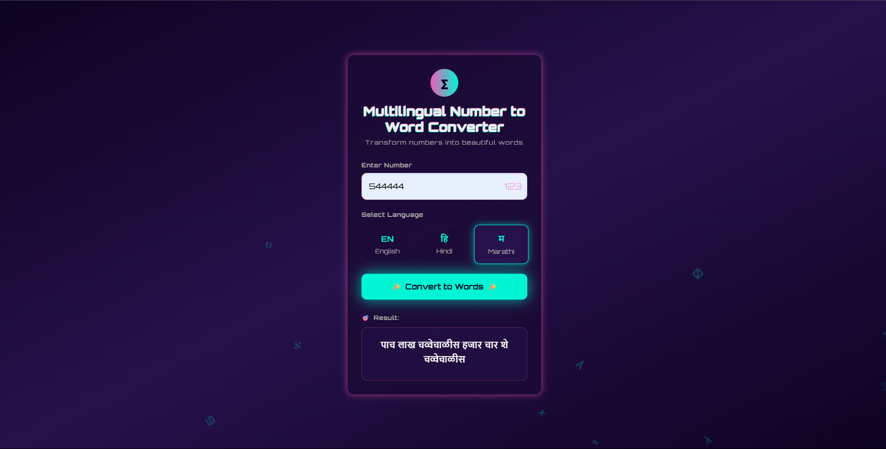

# Multilingual Number to Word Converter

A full-stack web application that converts numbers into their word representations, supporting multiple languages. This project features a stunning, animated Cyberpunk-themed frontend built with React and a robust, secure backend API powered by Django.



> **Note:** Take a screenshot of your running application and place it in a public folder or upload it to GitHub to replace the placeholder link above.

---

## ✨ Features

- **Multi-Language Support**: Seamlessly convert numbers into English, Hindi, and Marathi.
- **Interactive & Modern UI**: A visually striking Cyberpunk theme built with Tailwind CSS, featuring a glassmorphism card, glowing elements, and custom animations.
- **Component-Based Architecture**: The React frontend is built with clean, reusable components and custom hooks for a highly maintainable and scalable codebase.
- **Robust Backend API**: A secure Django API handles the conversion logic with comprehensive server-side validation.
- **Dynamic Feedback**: The UI provides instant feedback with loading states, success messages, and clear error handling.
- **Responsive Design**: The application is fully responsive and works beautifully on all screen sizes.

---

## 🚀 Tech Stack

| Category      | Technology                                                              |
|---------------|-------------------------------------------------------------------------|
| **Frontend**  | React.js, Tailwind CSS, Axios, Lucide React (Icons)                     |
| **Backend**   | Django, Django REST Framework (implicitly)                              |
| **Database**  | SQLite (for development)                                                |
| **Languages** | JavaScript, Python                                                      |

---

## 🏁 Getting Started

Follow these instructions to get a copy of the project up and running on your local machine for development and testing purposes.

### Prerequisites

Make sure you have the following installed on your system:
- [Python](https://www.python.org/downloads/) (3.8 or higher)
- [Node.js](https://nodejs.org/) (v14 or higher) and npm
- `pip` and `venv` for Python package management

### Installation & Setup

1.  **Clone the repository:**
    ```sh
    git clone <your-repository-url>
    cd numtowordconversion
    ```

2.  **Setup the Django Backend:**
    ```sh
    # Create and activate a virtual environment
    python -m venv .venv
    source .venv/bin/activate  # On Windows, use: .\.venv\Scripts\activate

    # Install backend dependencies
    pip install -r requirements.txt

    # Run the Django development server (in the root directory)
    python manage.py runserver
    ```
    The backend will be running at `http://127.0.0.1:8000`.

3.  **Setup the React Frontend:**
    Open a **new, separate terminal**.
    ```sh
    # Navigate to the frontend directory
    cd frontend

    # Install frontend dependencies
    npm install

    # Start the React development server
    npm start
    ```
    The frontend will open automatically in your browser at `http://localhost:3000`.

---

## ⚙️ API Endpoint

The backend exposes a single primary endpoint for the conversion functionality.

#### `POST /api/convert/`

Converts a given number string to its word representation in the specified language.

**Request Body (JSON):**
```json
{
  "number": "12345",
  "language": "english"
}
```

**Success Response (200 OK):**
```json
{
  "words": "twelve thousand three hundred forty-five"
}
```

**Error Response (400 Bad Request):**
```json
{
  "error": "Invalid language. Please use one of: english, hindi, marathi."
}
```

---

## 📂 Project Structure

The project is organized with a clear separation between the backend and frontend, promoting maintainability and scalability.

```
numtowordconversion/
├── NtoW/                 # Django app for conversion logic
├── frontend/             # React frontend application
│   ├── public/
│   └── src/
│       ├── components/   # Reusable UI components
│       ├── hooks/        # Custom React hooks
│       └── services/     # API communication layer
├── numtowordconversion/  # Django project settings
└── manage.py             # Django's command-line utility
```